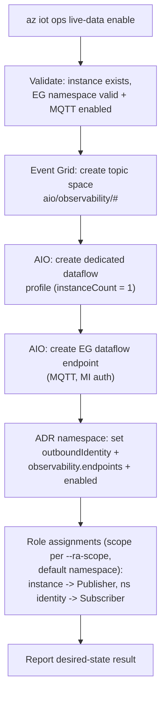
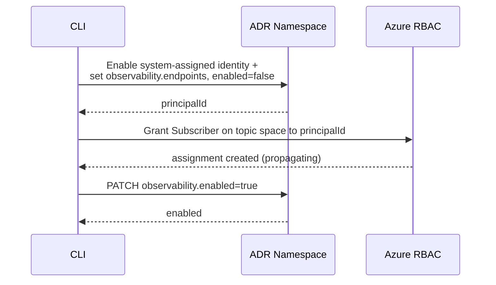
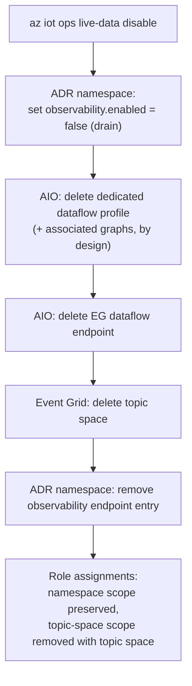

# Live Data — Azure CLI Design (`az iot ops live-data`)

Status: Draft for review\
Author: Ketki Naik\
Scope: The IT-admin CLI surface that enables, verifies, and disables **Live Data**
for an AIO instance.

---

## 1. Overview

This document covers the **IT-admin CLI** (`az iot ops live-data`) that enables,
verifies, and disables the shared, instance-level infrastructure required for Live
Data. (The OT-facing session experience in DOE is out of scope here.)

The CLI is **imperative** — it reads live Azure state and converges it to the
desired configuration. It does **not** deploy Bicep/ARM templates, and it does
**not** create any per-session Dataflow Graph or 1P transforms (those belong to
DOE).

---

## 2. Command design

A new command group `az iot ops live-data` with three commands:

| Command | Purpose |
|---|---|
| `az iot ops live-data enable` | Provision & configure the shared Live Data infrastructure for an AIO instance. |
| `az iot ops live-data show` | Report the Live Data configuration and resource status (or lack thereof). |
| `az iot ops live-data disable` | Tear down the instance-specific Live Data infrastructure. |

---

## 3. What each command does (CLI-side behavior)

### 3.1 `enable`

Converges the following resources across three domains (Event Grid, ADR namespace,
AIO instance), plus role assignments. All steps are idempotent — re-running adds to
shared resources without overwriting unrelated entries.

Resources created / configured:

> Each item is tagged **Created** (a net-new resource the CLI provisions) or
> **Configured** (an existing resource the CLI modifies). Every item is implemented
> in this CLI codebase as an imperative create-or-update call.

1. **Event Grid — topic space** — **Created**. Wildcard template `aio/observability/#`.
   Concrete session topics take the form
   `aio/observability/{scopeId}/{assetName}/{topicPath}`, where `scopeId` is the
   AIO instance name.
2. **AIO — dedicated Dataflow Profile** — **Created**. `instanceCount = 1`, distinct
   from the `default` profile so Live Data graphs are isolated and profile-wide
   changes do not restart unrelated dataflows.
3. **AIO — EG Dataflow Endpoint** — **Created**. MQTT, managed-identity auth, pointing
   at the customer's Event Grid namespace. Uses a system-assigned identity by
   default; a user-assigned identity may be supplied.
4. **ADR namespace link** — **Configured** (existing namespace PATCHed) via
   `properties.observability`:
   - `properties.outboundIdentity` = `SystemAssigned` (default) or `UserAssigned`.
     For SystemAssigned, the namespace's system-assigned identity is enabled if not
     already present.
   - `properties.observability.endpoints[<customLocationId>]` =
     `{ endpointType: "Microsoft.EventGrid/namespaces", address, scopeId, resourceId }`.
   - `properties.observability.enabled = true`.
5. **Role assignments** — **Created**. The scope is selectable via `--ra-scope`
   (default **namespace**):
   - AIO instance identity → **EventGrid TopicSpaces Publisher**
   - ADR namespace identity (SAMI/UAMI) → **EventGrid TopicSpaces Subscriber**

   The scope choice also determines whether the roles survive `disable` (see §3.2):
   - `--ra-scope namespace` (default) — scoped to the **EG namespace**. Durable: the
     assignment survives enable/disable cycles, so a privileged admin can grant it
     once and less-privileged IT admins can then run routine enable/disable with
     `--skip-role-assignments` (no `roleAssignments/write` needed each cycle).
   - `--ra-scope topic-space` — scoped to the **topic-space resource** (least
     privilege). Removed together with the topic space on `disable`, so each enable
     re-creates the assignment (requires `roleAssignments/write`).

> No Event Grid permission bindings are created: both the publisher (AIO instance)
> and subscriber (ADR namespace) authenticate with Microsoft Entra ID (managed
> identity), and EG client groups / permission bindings apply only to the
> certificate-client auth model.

#### Resource naming

Resource names are deterministic so `show` and `disable` can recompute them without
storing any state. The **AIO-instance-scoped** resources (dataflow profile and EG
dataflow endpoint) use **fixed** names — they are unique within their instance, and
DOE must reference them by exact name when creating the per-session Dataflow Graph,
so they must be predictable. The **EG topic space** lives in the **shared** Event
Grid namespace (which may serve multiple instances), so it carries an
instance-derived `hash8` suffix to stay globally unique; DOE does not reference it
by name (it publishes to the topic path `aio/observability/{scopeId}/...`).

`hash8` is the **first 8 hex characters of the SHA-256 hex digest of the AIO
instance's ARM resource ID** — i.e. `sha256(instance_resource_id.encode("utf8")).hexdigest()[:8]`.

| Resource | Scope | Name |
|---|---|---|
| Dataflow profile | AIO instance | `live-data-profile` |
| EG dataflow endpoint | AIO instance | `live-data-endpoint` |
| EG topic space | shared EG namespace | `live-data-ts-{hash8}` |

#### Enable flow



#### Staged enablement (new system-assigned identity)

When the ADR namespace's **system-assigned identity does not yet exist** (or has not
yet been granted the Subscriber role), a single `enabled=true` write is unsafe —
the identity's principal is only created during the update, and role-assignment
propagation is eventually consistent. In that case the CLI stages the enablement:



A one-call `enabled=true` is used only when the selected identity already exists
and already holds the Subscriber role (an existing namespace SAMI or a
pre-authorized UAMI).

### 3.2 `disable`

Tears down the instance-specific Live Data infrastructure. Whether the role
assignments are removed depends on the `--ra-scope` chosen at enable time (see
§3.1): **namespace**-scoped roles (default) are **preserved**; **topic-space**-scoped
roles are **removed together with the topic space**.

Order matters — **latch first, then teardown**:

1. **Latch → drain:** set `properties.observability.enabled = false`. This is the
   canonical ADR drain signal; active sessions end and no new sessions can start.
   (Removing an endpoint alone does *not* drain — sessions retain their endpoint
   snapshot.)
2. **Tear down instance-specific resources:**
   - AIO: dedicated Dataflow Profile (this also deletes any associated Dataflow
     Graphs — **by design**) and the EG Dataflow Endpoint.
   - Event Grid: topic space.
   - ADR namespace: remove the `observability.endpoints[<customLocationId>]` entry.
3. **Role assignments:** namespace-scoped assignments (default) are **preserved**;
   topic-space-scoped assignments are removed together with the topic space in
   step 2 (nothing is left orphaned).



### 3.3 `show`

Reads live Azure state and reports a single, easy-to-scan view of whether Live Data
is configured. Proposed output:

- **Enabled state** (`observability.enabled`)
- **Observability endpoint(s)** on the ADR namespace
- **Event Grid** topic space existence
- **AIO** dedicated dataflow profile + EG dataflow endpoint existence
- **Provisioning status** for deployed resources
- A top-level `enabled` rollup (true only when all pieces are present)

---

## 4. Command parameters

### `enable`

| Parameter | Required | Default | Notes |
|---|---|---|---|
| `--instance` / `-i` / `-n` | Yes | — | AIO instance name |
| `--resource-group` / `-g` | Yes | — | Instance resource group |
| `--eg-resource-id` | Yes | — | Event Grid namespace ARM resource Id |
| `--mi-user-assigned` | No | System-assigned MI | UAMI resource Id for the EG dataflow endpoint / outbound identity |
| `--ra-scope` | No | `namespace` | Role-assignment scope: `namespace` (durable, preserved on disable) or `topic-space` (least privilege, removed on disable) |
| `--adr-role-ids` | No | EG TopicSpaces Subscriber | Override role(s) for the ADR namespace identity |
| `--ops-role-ids` | No | EG TopicSpaces Publisher | Override role(s) for the AIO instance identity |
| `--skip-role-assignments` | No | off | Skip role assignments |
| `--no-progress` | No | off | Suppress progress UI |

### `show`

| Parameter | Required | Notes |
|---|---|---|
| `--instance` / `-i` / `-n` | Yes | AIO instance name |
| `--resource-group` / `-g` | Yes | Instance resource group |
| `--no-progress` | No | Suppress progress UI |

### `disable`

| Parameter | Required | Notes |
|---|---|---|
| `--instance` / `-i` / `-n` | Yes | AIO instance name |
| `--resource-group` / `-g` | Yes | Instance resource group |
| `--yes` / `-y` | No | Skip the confirmation prompt |
| `--no-progress` | No | Suppress progress UI |

### Examples

```bash
# Enable Live Data (system-assigned identity, default roles)
az iot ops live-data enable \
  --instance myInstance -g myResourceGroup \
  --eg-resource-id /subscriptions/00000000-0000-0000-0000-000000000000/resourceGroups/egRg/providers/Microsoft.EventGrid/namespaces/myEventGrid

# Enable using a user-assigned managed identity for outbound auth
az iot ops live-data enable \
  --instance myInstance -g myResourceGroup \
  --eg-resource-id /subscriptions/00000000-0000-0000-0000-000000000000/resourceGroups/egRg/providers/Microsoft.EventGrid/namespaces/myEventGrid \
  --mi-user-assigned /subscriptions/00000000-0000-0000-0000-000000000000/resourceGroups/idRg/providers/Microsoft.ManagedIdentity/userAssignedIdentities/myUami

# Enable but skip role assignments (grant them separately)
az iot ops live-data enable \
  --instance myInstance -g myResourceGroup \
  --eg-resource-id /subscriptions/00000000-0000-0000-0000-000000000000/resourceGroups/egRg/providers/Microsoft.EventGrid/namespaces/myEventGrid \
  --skip-role-assignments

# Enable with custom role-definition GUIDs
az iot ops live-data enable \
  --instance myInstance -g myResourceGroup \
  --eg-resource-id /subscriptions/00000000-0000-0000-0000-000000000000/resourceGroups/egRg/providers/Microsoft.EventGrid/namespaces/myEventGrid \
  --adr-role-ids 4b0f2fd7-60b4-4eca-896f-4435034f8bf5 \
  --ops-role-ids a12b0b94-b317-4dcd-84a8-502ce99884c6

# Enable with least-privilege, topic-space-scoped role assignments
# (roles are removed with the topic space on disable)
az iot ops live-data enable \
  --instance myInstance -g myResourceGroup \
  --eg-resource-id /subscriptions/00000000-0000-0000-0000-000000000000/resourceGroups/egRg/providers/Microsoft.EventGrid/namespaces/myEventGrid \
  --ra-scope topic-space

# Verify the Live Data configuration and resource status
az iot ops live-data show --instance myInstance -g myResourceGroup

# Disable Live Data (prompts for confirmation)
az iot ops live-data disable --instance myInstance -g myResourceGroup

# Disable without the confirmation prompt
az iot ops live-data disable --instance myInstance -g myResourceGroup --yes
```

---

## 5. `mgmt-actions` vs `live-data`

Live Data is the second "outer loop" feature after management-actions and follows
the same enable / show / disable pattern, but keeps its resources **logically
separate** (its own `observability` bag and dedicated resources) so the two can be
governed independently. The shared Event Grid / ADR / role-assignment logic will be
extracted into a common module used by both command groups. The table below
summarizes the differences.

| Aspect | `mgmt-actions` | `live-data` |
|---|---|---|
| Commands | enable / disable / show / **execute** | enable / disable / show |
| ADR property bag | `properties.management.endpoints` | `properties.observability` (`enabled` + `endpoints`) |
| Enable latch | none | `observability.enabled` (true on enable, false on disable) |
| ADR identity | top-level system-assigned identity | `properties.outboundIdentity` (SAMI or UAMI) |
| EG topic space | `actions/requests\|responses/{scope}/#` | `aio/observability/#` |
| Dataflow profile | `default` (overridable via `--dataflow-profile`) | **dedicated** — `live-data-profile`, `instanceCount = 1` |
| Dataflow graph | created by CLI (request graph + response dataflow) | **none** — DOE creates the per-session graph |
| Transforms | graph rules engine | none (DOE owns session transforms) |
| Role assignments | Publisher + Subscriber to **both** principals | **split**: instance → Publisher, ns identity → Subscriber |
| Role scope | EG **namespace** | selectable via `--ra-scope` — **namespace** (default) or **topic space** (least privilege) |

---

## 6. Dependencies & open items

- **ADR SDK regen (coding-phase):** the vendored `deviceregistrymgmt` client is
  pinned to api-version `2026-04-01`, which does not know `observability`. It must
  be regenerated against `2026-11-02-preview` before the CLI can read/write the
  bag. The contract is confirmed stable by ADR.
- **Timeline:** the parent Live Data feature targets 2Wk05 (Aug 23 – Sep 5) for DOE
  integration; ADR deployment is not yet scheduled. CLI end-to-end testing depends
  on a deployed `2026-11-02-preview` endpoint / region availability (regional
  feature filter).
- **Confirmed contract references:**
  `azure-rest-api-specs-pr` @ `release-adr-development` →
  `specification/deviceregistry/resource-manager/Microsoft.DeviceRegistry/preview/2026-11-02-preview/deviceregistry.json`
  and `DeviceRegistry.Management/namespaces.tsp`.
